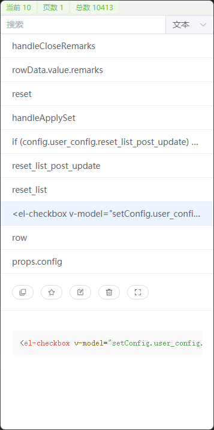

# Clerk 剪切板工具

## 介绍

一个 Electron + Vue + Element Plus 开发的剪切板记录工具

- 支持自动记录文本、图片、文件
- 支持代码高亮
- 支持分类搜索、收藏、备注、一键复制粘贴



## 操作

### 呼出

- 点击托盘图标
- 快捷键

### 翻页

- 上下箭头键
- 鼠标滚轮
- Pg键

### 快速选中

- 按住ctrl键，鼠标移动到某一行就会选中某一行的数据

### 复制条目

- 选中条目后双击条目
- Enter键
- Ctrl+c键
- 鼠标右键

### 全屏模式

- 点击全屏按钮

### 删除条目

- Delete键

## 调试

```bash
yarn run electron:serve
```

## 打包

```bash
yarn run electron:build
```

## 注意事项

### 兼容性

目前只在 Windows11 平台测试过，理论上任何 Electron 支持的平台都可以使用，可能需要适配

### 配置

```json
{
  "enable_win_tools": true,
  "win_tools_port": 50051,
  "shortcut_keys": "Ctrl+Right",
  "db_file": "USER_HOME./clerk/clerk.db",
  "max_number": 0,
  "max_time": 0,
  "blur_hide": true,
  "copy_hide": true,
  "hide_paste": true,
  "page_size": 10,
  "enable_text": true,
  "enable_image": true,
  "enable_file": true
}
```

- `enable_win_tools` 是否启用 WinTools
- `win_tools_port` WinTools 端口号
- `shortcut_keys` 快捷键
- `db_file` 数据库文件
- `max_number` 最大保留的条目数量
- `max_time` 最大保留时间(秒)
- `blur_hide` 窗口失焦时是否最小化
- `copy_hide` 是否允许复制后最小化
- `hide_paste` 复制并最小化后是否自动粘贴
- `page_size` 分页大小
- `enable_text` 是否支持文本
- `enable_image` 是否支持图片
- `enable_file` 是否支持文件

安装成功后配置文件在 `USER_HOME./clerk/config.json` 也可以在启动的时候 `--config=xxx` 指定配置文件路径  
数据文件在 `USER_HOME./clerk.db`

### WinTools

#### 功能

以下功能需要 `WinTools`

- 复制后自动激活顶层窗口并粘贴
- 对文件类型的剪切板支持

`WinTools` 基于 `.NET Desktop`
框架需要安装 `.NET Desktop Runtime` [下载地址](https://download.visualstudio.microsoft.com/download/pr/dffb1939-cef1-4db3-a579-5475a3061cdd/578b208733c914c7b7357f6baa4ecfd6/windowsdesktop-runtime-7.0.5-win-x64.exe)

####

```bash
cd WinTools
dotnet build --configuration Release
```
